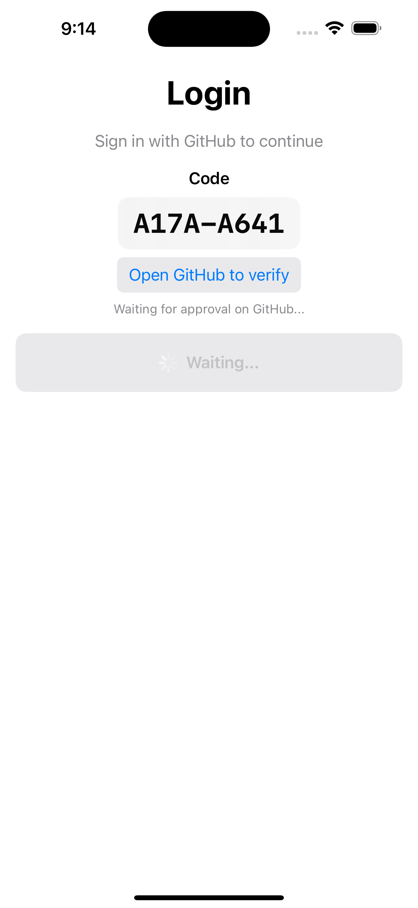
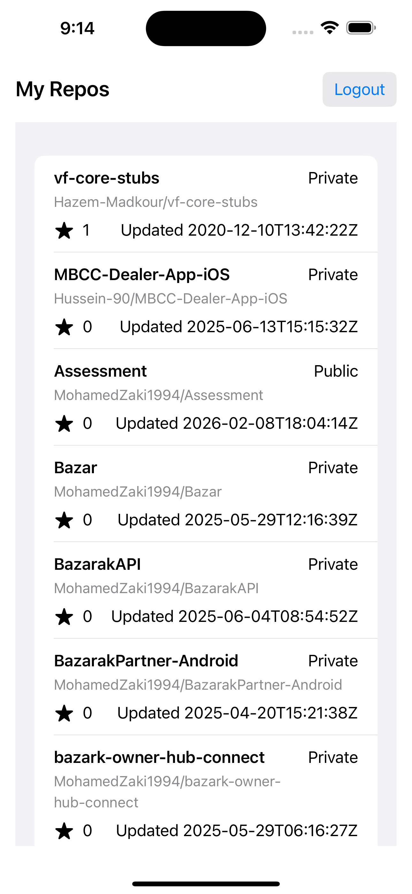

# Assessment

A GitHub repository viewer using the Device Flow authentication method.

## Setup

- **iOS Version**: 16.0+
- **Xcode Version**: 16.0+

## Authentication Flow

This project uses the **GitHub Device Flow** for authentication. This approach is chosen to avoid storing the Client Secret in the frontend application, enhancing security.

### Scenario

1.  **Initiate Login**: When the user taps "Sign in with GitHub", the app sends a `POST` request to `/login/device/code`.
2.  **Receive Code**: GitHub responds with a `user_code`, `verification_uri`, `device_code`, and `interval`.
3.  **User Verification**: The app displays the `user_code` and provides a button to open `verification_uri` in the browser. The user authenticates with GitHub and enters the code.
4.  **Polling**: In the background, the app polls `/login/oauth/access_token` at the specified `interval`.
5.  **Completion**:
    -   If pending: The app waits and retries.
    -   If success: GitHub returns an `access_token`.
    -   The token is securely stored in the **Keychain**.

**Note**: The implementation uses `ObservableObject` and `@Published` properties to ensure compatibility with iOS 16.

## Network Layer

The network layer is centralized and type-safe:

-   **Base URL**: `https://github.com` (for auth) and `https://api.github.com` (for data).
-   **Endpoints**: Managed via an `Endpoint` enum to prevent hardcoded strings and ensure correct URL construction.

## Future Improvements

Given more time, the following improvements would be implemented:

-   **Dependency Injection**: Use a **Factory Package** or container. Currently, ViewModels initialize Repositories, leading to multiple instances. A DI container would ensure singleton management and easier testing.
-   **Clean Architecture**: Separate **Data Models** (Backend) from **Domain Models** (App). A mapping layer in the Data tier would translate between them.
-   **Concurrency**: Resolve the `MainActor` isolation warning (`init(repository:)` in a synchronous context) with a robust architectural fix.
-   **Navigation**: Implement a full **Coordinator** pattern with a dedicated engine in a separate package, decoupling navigation logic from Views.
-   **Testing**: Add Unit Tests for ViewModels and Repositories. The current use of protocols makes mocking straightforward.
-   **Search & Filter**: Implement local search/filter logic using original vs. filtered data arrays to avoid unnecessary network calls with bouncing.
-   **UI/UX**: Refactor views into reusable components within a **Design System**.
-   **Repo Details**: Implement the "Repo Details" screen to show comprehensive repository information.

## Screenshots

| Login | Verification | My Repos |
|:---:|:---:|:---:|
|  |  |  |
